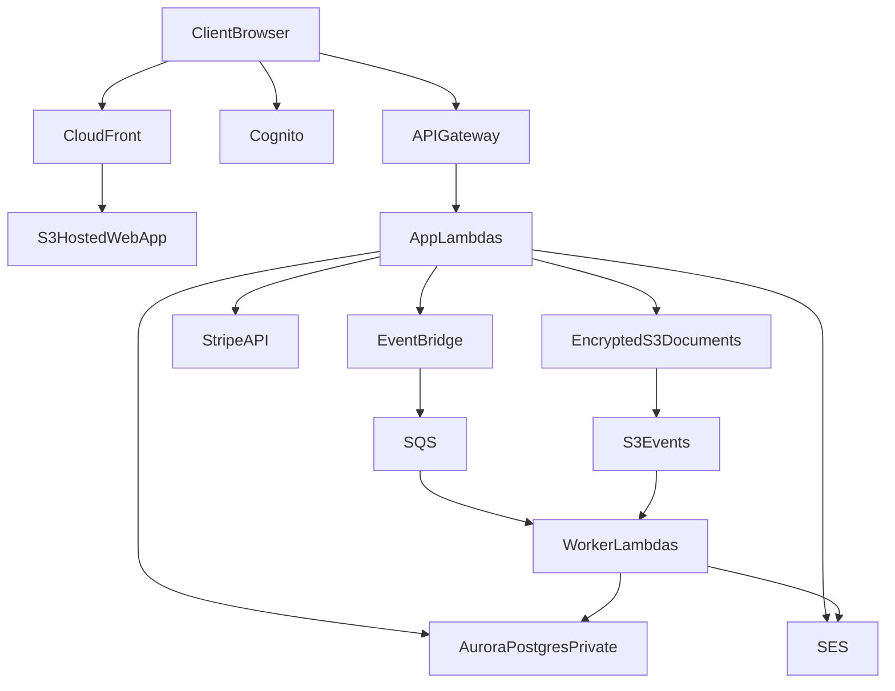

# AWS Architecture

## Target Outcome
Deliver one branded system with a public site, secure client portal, and admin operations dashboard while keeping PHI inside an AWS-centered HIPAA-capable architecture.

## Service Selection

### Edge and frontend
- `Amazon CloudFront` for CDN delivery and TLS termination
- `Amazon S3` for static site assets and generated downloads
- `Next.js` frontend deployed as a static-first app, with room to add server-rendered routes later if needed

### Identity and access
- `Amazon Cognito User Pool` for application authentication
- Cognito groups for `owner`, `assistant`, and `client`
- optional custom claims enrichment for fine-grained authorization context

### API and business logic
- `Amazon API Gateway` for authenticated REST endpoints
- `AWS Lambda` for core application handlers and background workers
- `Amazon EventBridge` for business events and delayed automations
- `Amazon SQS` for durable async processing and retry handling

### Data and storage
- `Amazon Aurora PostgreSQL Serverless v2` as the primary system-of-record database
- `Amazon S3` for encrypted document storage using structured object key prefixes
- `AWS KMS` for managed encryption keys
- `AWS Secrets Manager` for Stripe keys, webhook secrets, and database credentials

### Notifications and observability
- `Amazon SES` for transactional email
- `Amazon CloudWatch` for application logs, metrics, dashboards, and alarms
- `AWS CloudTrail` for API audit trails
- `AWS Config` for configuration drift and security rule enforcement
- `Amazon GuardDuty` for threat detection

## Network Boundaries
Use a dedicated VPC with public and private subnets.

- Public subnet components:
  - only internet-facing endpoints that truly need public access
  - if used later, a load balancer or NAT resources
- Private subnet components:
  - Aurora PostgreSQL
  - Lambda functions that need database access
  - worker services and internal processing

Recommended principle:
- keep the database private at all times
- do not expose S3 buckets publicly
- access documents only through controlled application flows and short-lived presigned URLs

## Reference Flow

## Document Storage Pattern
Use direct-to-S3 upload with backend-issued presigned requests.

Recommended object key pattern:
`clients/{clientProfileId}/documents/{documentType}/{yyyy}/{mm}/{documentId}-{originalFilename}`

Why:
- keeps the app server from proxying large files
- simplifies authorization checks
- supports lifecycle and archival policies by prefix
- produces a clean audit trail when paired with metadata records

Required controls:
- S3 block public access
- SSE-KMS encryption
- versioning enabled
- bucket access logging
- short-lived presigned POST or URL generation
- file type and file size validation before signing

## Database Guidance
Use Aurora PostgreSQL Serverless v2 for the MVP because the system has:
- many related records around one client profile
- internal/admin reporting needs
- workflow joins across tasks, documents, messages, and payments
- likely need for flexible querying by stage, date, assistant, and service type

Use DynamoDB only if later needed for:
- high-volume event logs
- ephemeral idempotency keys
- isolated feature workloads

## Security Baseline
This project must be treated as HIPAA-capable architecture, not just secure-by-default hosting.

Minimum controls:
- execute an AWS BAA before storing PHI
- use only HIPAA-eligible AWS services where PHI is stored, processed, or transmitted
- encrypt S3, Aurora, snapshots, and secrets with KMS
- enforce TLS in transit
- keep PHI out of logs, analytics tools, and email bodies
- use least-privilege IAM roles for every Lambda and operator
- require MFA for admin users
- maintain environment separation across `dev`, `staging`, and `prod`
- add retention and recovery policies for database backups and document versions
- create explicit incident response and access review procedures outside the codebase

## Authorization Model
Recommended enforcement layers:
- Cognito authentication for identity
- role checks in API handlers
- record ownership checks in service logic
- database-level constraints where practical

Examples:
- client can only list their own documents and messages
- assistant can only access assigned client profiles
- owner can access all records, provider content, and revenue views

## External Integrations

### Stripe
Use:
- Checkout or Payment Links for fast MVP payments
- webhooks for account unlock, invoice updates, refunds, and subscriptions

### Scheduling
Use an embedded hosted scheduler first, then replace later if direct scheduling becomes a bottleneck.

### QuickBooks Online
Use a Stripe-to-QBO connector instead of building accounting sync from scratch in the MVP.

## Infrastructure-as-Code Recommendation
Prefer `AWS CDK` in TypeScript for this project because:
- it matches the future app language stack
- it makes AWS resource composition easier for a greenfield app
- it supports environment-specific stacks cleanly

Suggested future infra modules:
- networking
- auth
- data
- storage
- api
- async-jobs
- monitoring
- domain-and-dns

## Non-Goals for MVP
- provider payouts
- escrow logic
- AI processing of PHI before eligibility and compliance review
- custom SMS system on day one
- over-automated analytics that increase compliance scope without saving time
