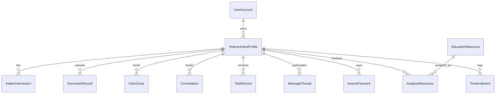

# Domain Model

## Core Record
The system is centered on `VeteranClientProfile`. It is the operational source of truth for client identity, military background, claim status, assigned work, uploaded records, and education delivery.

## Design Principles
- Use one client profile per veteran/client, even if multiple services or claim cycles occur over time.
- Keep PHI-bearing files in S3 and only store metadata and access references in the relational database.
- Represent client-visible progress separately from internal operational notes so the portal feels simple.
- Use append-only `TimelineEvent` records to preserve a clean activity history.

## Primary Entities

### `UserAccount`
Represents the authenticated identity from Cognito and the application role.

Key fields:
- `cognitoSub`
- `email`
- `phone`
- `role`
- `displayName`
- `isActive`

### `VeteranClientProfile`
Primary business record for the veteran/client.

Key fields:
- contact details
- emergency contact
- military/service background
- claim history summary
- claimed conditions
- current portal stage
- assigned owner and assistant
- tags and last activity timestamps

### `IntakeSubmission`
Versioned intake answers. This allows the intake questionnaire to evolve without losing historical responses.

### `DocumentRecord`
Metadata for uploaded files. Binary data stays in S3, while the app stores:
- document type
- title and description
- `s3Key`
- file size and MIME type
- status and review notes
- dates, tags, and checksum

### `ClaimCase`
Tracks client-friendly progress stages and internal evidence gap assessment.

### `Consultation`
Stores bookings, attendance, recommendations, and summaries for:
- initial consultation
- follow-up consultation
- record review
- evidence organization
- workshops or academy sessions

### `TaskRecord`
Supports both internal operations and client-facing action items.

Important flags:
- `visibility`: `internal` or `client_visible`
- `status`
- assignee
- due and reminder dates

### `MessageThread` and `MessageEntry`
Supports secure portal communication. Messages should remain inside the portal instead of email whenever PHI may be involved.

### `InvoicePayment`
Stores Stripe references without making Stripe the only source of truth for financial reporting in the app.

### `EducationResource` and `AssignedResource`
Separates reusable content from client-specific assignments and completion tracking.

### `ProviderDirectoryEntry`
Public informational listing only. This entity must not introduce payout, referral, or commission workflows.

### `TimelineEvent`
Append-only activity trail for client and admin actions such as:
- intake submitted
- payment received
- records uploaded
- documents reviewed
- task completed
- consultation completed
- resource assigned

## Relationship Map

## Suggested Postgres Boundaries

### Tables likely needed in the MVP relational database
- `user_accounts`
- `client_profiles`
- `intake_submissions`
- `documents`
- `claim_cases`
- `consultations`
- `tasks`
- `message_threads`
- `message_entries`
- `invoice_payments`
- `education_resources`
- `assigned_resources`
- `provider_directory_entries`
- `timeline_events`

### Data better kept outside Postgres
- raw file binaries in S3
- email delivery logs in SES/CloudWatch
- async job payloads in SQS/EventBridge
- infrastructure audit logs in CloudTrail

## Multi-Tenant Model
This MVP is operationally single-business and single-owner, but it should still enforce row-level ownership concepts:
- clients can only access their own profile-related records
- assistants can access assigned clients only
- owner can access all records

## Open Extension Points
- support multiple claim cases over time per client
- track academy memberships separately from one-off resources
- attach structured document extraction results later if a compliant workflow is added
- add internal review checklists on top of `DocumentRecord` without changing the file model
